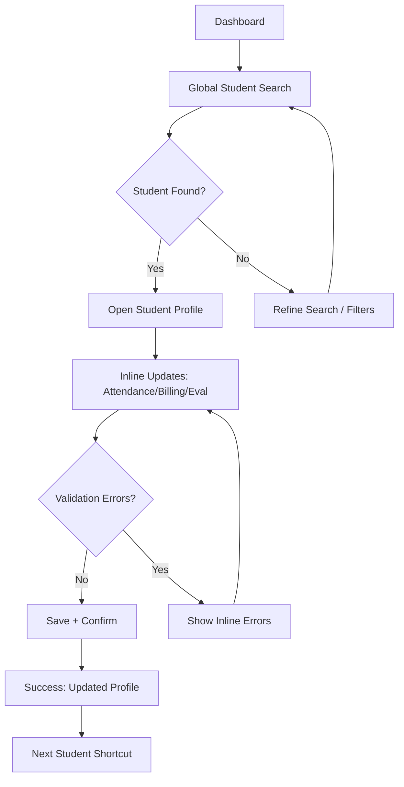
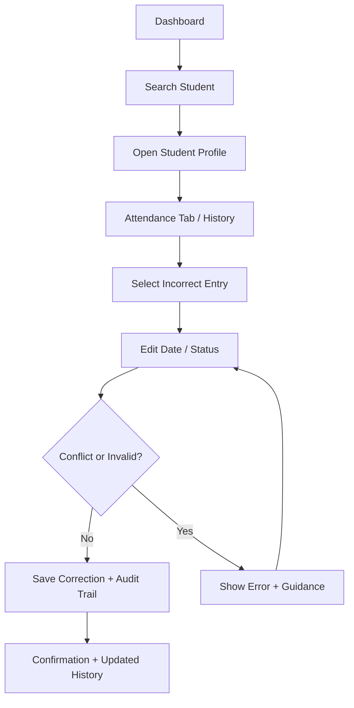
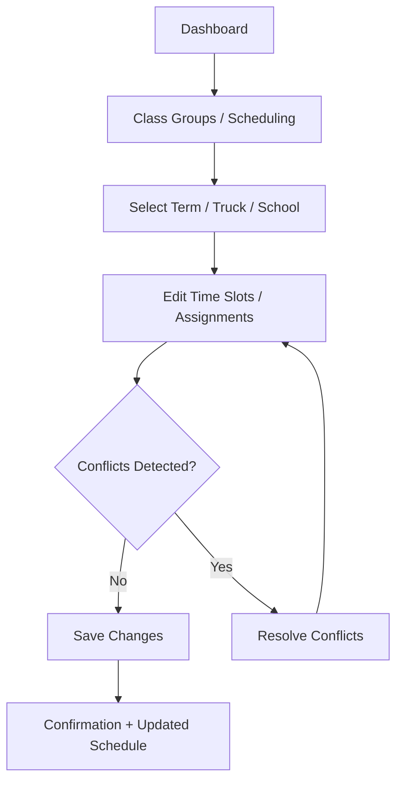

---
stepsCompleted:
  - 'step-01-init'
  - 'step-02-discovery'
  - 'step-03-core-experience'
  - 'step-04-emotional-response'
  - 'step-05-inspiration'
  - 'step-06-design-system'
  - 'step-07-defining-experience'
  - 'step-08-visual-foundation'
  - 'step-09-design-directions'
  - 'step-10-user-journeys'
  - 'step-11-component-strategy'
  - 'step-12-ux-patterns'
  - 'step-13-responsive-accessibility'
  - 'step-14-complete'
inputDocuments:
  - "_bmad-output/planning-artifacts/prd.md"
  - "docs/index.md"
  - "docs/architecture.md"
  - "docs/domain-models.md"
  - "docs/development-guide.md"
  - "docs/source-tree.md"
  - "docs/project_context.md"
  - "docs/ux-design-specification.md"
  - "docs/legacy/4_Children/1_Child_Information.png"
  - "docs/legacy/4_Children/2_Child_Financial.png"
  - "docs/legacy/4_Children/3_Class_Group.png"
  - "docs/legacy/4_Children/4_Class_Group_Attendance.png"
  - "docs/legacy/4_Children/5_Child_Evaluation.png"
  - "docs/legacy/4_Children/6_Class_Groups_Evaluation.png"
workflowType: 'ux-design'
lastStep: 14
project_name: 'kcow-online'
user_name: 'Joe'
date: '2026-01-03'
---

# UX Design Specification kcow-online

**Author:** Joe
**Date:** 2026-01-03

---

<!-- UX design content will be appended sequentially through collaborative workflow steps -->

## Executive Summary

### Project Vision
A single-admin web app to run two mobile computer literacy trucks across multiple school.

### Target Users
- Mobile Computer Lab Administrator: manages schedustudentsles, attendance/progress, activities, billing, for two trucks serving many schools.
- Supporting roles (indirect): teachers/drivers as assignees; parents/students as records/billing contacts.

### Key Design Challenges
- Keep navigation and task switching fast for one admin spanning many modules.
- Prevent overbooking and make schedule/timeslot capacity obvious.
- Reduce friction in heavy form workflows (people, schools, billing) with validation and defaults.
- Provide clear operational status for trucks, routes, and visits.

### Design Opportunities
- Sidebar/breadcrumb structure that mirrors the domain modules.
- Form helpers (search/prefill/validation) for people and schools.
- Billing UI with pro-rata calculators and family rollups surfaced inline.

## Core User Experience

### Defining Experience
The core loop is instant student lookup with a rich profile view: search, land on the correct student, and immediately see status plus next actions (attendance, progress, billing). Everything else should orbit this flow.

### Platform Strategy
Desktop web as the primary surface; no offline requirement. Keyboard-first but touch-tolerant layouts are acceptable; optimize for fast scanning and data density on desktop.

### Effortless Interactions
- Instant search/typeahead that narrows by name/school/grade and resists ambiguity.
- Profile page that surfaces attendance history, progress highlights, and billing state without drilling.
- One-click/low-friction actions from the profile: mark attendance, update billing, assign to timeslot/lesson.
- Capacity/eligibility cues inline when acting (e.g., warn/prevent overbooking).

### Critical Success Moments
- Finding the right student quickly with confidence (no name collisions confusion).
- Seeing a clear status snapshot (attendance streaks, progress level, billing standing) at a glance.
- Acting immediately (mark attendance, record payment, assign) without losing context or switching modules.

### Experience Principles
- Prioritize the lookup-to-action flow above everything else.
- Make state obvious: attendance, progress, and billing should be legible without clicks.
- Reduce hops: keep actions in the same view; avoid cross-module detours.
- Prevent mistakes: highlight capacity/conflicts and confirm destructive changes.

## Desired Emotional Response

### Primary Emotional Goals
- Confident accuracy: the admin feels sure every lookup, status view, and update is correct and reflected immediately.

### Emotional Journey Mapping
- First-time: reassured that navigation and search are obvious; nothing feels hidden.
- During core flow: calm, confident, and in control while searching, reviewing status, and acting.
- After actions: certainty that changes stuck (attendance/billing updates are saved and visible).
- Error states: guided, not blamed; clear recovery without doubt.
- Return visits: trust that data is current and the same fast flow awaits.

### Micro-Emotions
- Confidence over skepticism: clear identifiers and confirmations reduce doubt.
- Clarity over confusion: unambiguous naming, search disambiguation, and inline cues.
- Control over anxiety: preview effects (capacity/eligibility) before committing.

### Design Implications
- Show strong disambiguation in search results (name + school + grade) and clear selection state.
- Surface confirmations and recent changes inline (e.g., "Attendance saved · just now").
- Keep error handling prescriptive: explain what went wrong and the exact next fix.
- Use consistent status chips for attendance/progress/billing; avoid ambiguous colors/labels.

### Emotional Design Principles
- Make accuracy feel visible: reinforce correctness with confirmations and stable identifiers.
- Never leave the user guessing: remove ambiguity in search, actions, and status.
- Calm guidance over blame: errors and conflicts come with clear, low-friction fixes.

## UX Pattern Analysis & Inspiration

### Inspiring Products Analysis

- **Legacy KCOW Access UI**: Dense, information-rich single-screen workflows with inline edits, tabbed sub-views, and color-coded sections for fast scanning. The strength is speed and completeness; the weakness is visual clutter and inconsistent hierarchy.

### Transferable UX Patterns

**Navigation Patterns:**
- Persistent module sidebar + breadcrumbs for quick jumps across Schools, Class Groups, Students.
- Tabbed sub-sections within the Student Profile to keep the single-screen paradigm without page changes.

**Interaction Patterns:**
- Search-first workflow (typeahead, strong disambiguation) as the primary entry into the core loop.
- Inline edit + save confirmation for high-frequency fields (attendance, billing status, evaluation notes).
- Data-dense tables with pinned key identifiers and sticky headers.

**Visual Patterns:**
- Color-coded section headers (subtle, modernized) to preserve scanability without harsh saturation.
- Compact form spacing and aligned labels for speed and precision.

### Anti-Patterns to Avoid

- Overly cluttered screens with no visual hierarchy.
- Ambiguous labels and inconsistent field grouping.
- Actions hidden behind multiple dialogs or navigation hops.
- Overuse of saturated colors that reduce readability.

### Design Inspiration Strategy

**What to Adopt:**
- Dense, single-screen profile with tabbed sub-sections.
- Search-first navigation and fast inline updates.

**What to Adapt:**
- Modernize color coding with restrained palettes and consistent tokens.
- Maintain data density but add whitespace and grouping to improve hierarchy.

**What to Avoid:**
- Legacy-level clutter and inconsistent visual language.
- Excess modal dialogs or multi-page detours for core tasks.

## Design System Foundation

### 1.1 Design System Choice

Themeable system using Tailwind CSS + DaisyUI (existing project stack).

### Rationale for Selection

- Aligns with the current frontend stack and avoids rework.
- Fast delivery with consistent components and styling.
- Supports dense admin UI patterns while keeping customization flexibility.

### Implementation Approach

- Use DaisyUI components as the baseline UI layer.
- Apply Tailwind utilities for layout control and data-dense screens.
- Keep to existing DaisyUI theme presets (no custom theme for v1).

### Customization Strategy

- Use DaisyUI defaults for colors and typography.
- Favor comfortable spacing while maintaining data density through layout grouping and tables.

## 2. Core User Experience

### 2.1 Defining Experience

A single-screen student profile where the admin searches once, lands on the correct student, and completes attendance, billing, and evaluation updates without leaving the view.

### 2.2 User Mental Model

The admin expects a dense, tabbed profile like the legacy Access form with minimal navigation. They expect search by name/school/grade to be fast and unambiguous. Frustrations include bouncing between tabs, uncertainty about what saved, and delays when finding the right student.

### 2.3 Success Criteria

- The admin can identify the correct student within seconds.
- The admin completes all updates in one uninterrupted flow.
- Clear confirmation that changes were saved and visible immediately.
- No ambiguous search results or context loss.

### 2.4 Novel UX Patterns

Established patterns (admin CRUD with a tabbed profile and inline edits), modernized for clarity and confidence.

### 2.5 Experience Mechanics

**Initiation:** Global search or class group list entry point.  
**Interaction:** Select student; open single-screen profile with tabs; inline edits for high-frequency fields.  
**Feedback:** Immediate validation, visible status chips, and saved confirmations.  
**Completion:** Updated state visible instantly; quick path to next student.

## Visual Design Foundation

### Color System

- Use DaisyUI default dark theme as the baseline.
- Semantic color mapping follows DaisyUI tokens (primary/secondary/accent/success/warning/error).
- Maintain sufficient contrast for dense data tables and form fields.

### Typography System

- Professional tone using DaisyUI default sans-serif stack.
- Standard heading/body hierarchy from DaisyUI defaults to keep consistency across screens.

### Spacing & Layout Foundation

- Comfortable density with an 8px spacing scale.
- 12-column grid for main layouts; data-dense sections can collapse into flexible grids.
- Grouping and whitespace used to create hierarchy without sacrificing scanability.

### Accessibility Considerations

- Ensure contrast remains readable on dark theme, especially for tables and status chips.
- Keyboard-first interactions with visible focus states.
- Avoid relying on color alone to indicate status.

## Design Direction Decision

### Design Directions Explored

- Explored six directions emphasizing dense data workflows, tabbed profiles, and status-first layouts.
- Compared layout hierarchy, visual weight, and table readability for admin speed.

### Chosen Direction

**Direction 3: Quiet Control**  
Comfortable density, soft hierarchy, and reduced cognitive load while preserving data richness.

### Design Rationale

- Matches the calm, confident, in control emotional goal.
- Supports the single-screen profile without visual clutter.
- Encourages fast scanning with clear grouping and minimal noise.

### Implementation Approach

- Use the Direction 3 layout as the base for the student profile and admin modules.
- Apply tabbed sub-sections and compact tables with gentle contrast.
- Keep UI elements restrained; prioritize clarity over decorative elements.

## User Journey Flows

### One-Screen Student Update (Success Path)

**Flow Description:**  
Admin starts from the Dashboard, searches for a student, lands on the single-screen profile, updates attendance/billing/evaluation inline, and confirms changes.

### Fix Attendance on Wrong Day (Edge Case)

**Flow Description:**  
Admin navigates from Dashboard to student profile, opens attendance history, corrects date, and saves with audit trail.

### New Term Schedule Updates (Periodic Task)

**Flow Description:**  
Admin starts on Dashboard, navigates to Class Groups, updates term schedule, resolves conflicts, and applies changes.

### Journey Patterns

- Search-first entry into student-centric flows.
- Tabbed sub-sections for dense profile without navigation hops.
- Inline edit + validation for high-frequency fields.
- Save confirmation + audit trail to reinforce trust.

### Flow Optimization Principles

- Minimize steps to value (search -> profile -> update).
- Keep context in a single screen; avoid modal detours.
- Make errors inline and recoverable without losing progress.
- Provide next student shortcuts for rapid batch work.

## Component Strategy

### Design System Components

Use DaisyUI baseline components for:
- Buttons, inputs, selects, toggles, checkboxes
- Tabs, cards, badges, tooltips
- Tables, pagination, modals, alerts
- Breadcrumbs, side navigation, top bar
- Toasts/notifications and status chips

### Custom Components

### Global Student Search Bar
**Purpose:** Primary entry into the core workflow.  
**Usage:** Persistent in top bar; supports name/school/grade search.  
**States:** Default, focused, loading, no results, error.  
**Accessibility:** Keyboard focus, ARIA live updates for results.

### Student Profile - Three-Column Grid
**Purpose:** Single-screen dense profile editing.  
**Usage:** Core Student view with tabs for Child Info/Financial/Attendance/Evaluation.  
**States:** Default, editing, validation error, saving, saved.  
**Accessibility:** Grouped fieldsets, clear labels, keyboard navigation.

### Status Chips / Inline Confirmations
**Purpose:** Make state obvious at a glance.  
**Usage:** Attendance/billing/evaluation statuses and save confirmations.  
**States:** Neutral, success, warning, error.

### Inline Edit Row
**Purpose:** Fast updates without leaving the screen.  
**Usage:** Attendance entries, billing rows, evaluation notes.  
**States:** Editing, valid, invalid, saving, saved.

### Audit Trail Panel
**Purpose:** Trust and traceability for corrections.  
**Usage:** Attendance and billing changes with timestamp and actor.  
**States:** Empty, populated.

### Family Grid
**Purpose:** Show sibling context and linked records.  
**Usage:** Bottom section of student profile.  
**States:** Empty, populated, highlight selected.

### Schedule Conflict Banner
**Purpose:** Prevent overbooking and conflicts.  
**Usage:** Class group scheduling view.  
**States:** Warning, resolved.

### Component Implementation Strategy

- Build custom components using DaisyUI tokens and Tailwind utilities.
- Keep shared components in `shared/components` and feature-specific in `features/*`.
- Enforce keyboard-first usage and consistent validation visuals.
- Prefer composable, testable components with clear states.

### Implementation Roadmap

**Phase 1 - Core Components:**  
Global Search, Student Profile Grid, Inline Edit Row, Status Chips

**Phase 2 - Supporting Components:**  
Family Grid, Audit Trail Panel, Schedule Conflict Banner

## UX Consistency Patterns

### Button Hierarchy
**When to Use:** Primary actions (save, create, confirm) vs secondary (cancel, back).  
**Visual Design:** Primary button uses DaisyUI `btn-primary`; secondary uses `btn-ghost` or `btn-outline`.  
**Behavior:** Primary action is right-aligned or top-right in toolbars; destructive actions separated.  
**Accessibility:** Clear focus ring; keyboard activation via Enter/Space.

### Feedback Patterns
**When to Use:** After any save, update, delete, or validation error.  
**Visual Design:** Inline field errors + toast confirmation for global actions.  
**Behavior:** Success toasts are brief; errors remain until resolved.  
**Accessibility:** ARIA live region for toasts and validation summaries.

### Form Patterns
**When to Use:** Data entry for schools, class groups, students.  
**Visual Design:** Grouped fieldsets with clear section headers; consistent label alignment.  
**Behavior:** Inline validation on blur; block save until critical fields valid.  
**Accessibility:** Labels tied to inputs; error messages read by screen readers.

### Navigation Patterns
**When to Use:** Switching modules and student sub-sections.  
**Visual Design:** Persistent sidebar for modules + tabbed sub-sections in Student Profile.  
**Behavior:** Maintain context (student stays selected when moving between tabs).  
**Accessibility:** Keyboard navigable tabs with visible focus.

### Inline Panels & Confirmations (No Modals)
**When to Use:** Destructive actions, quick edits, confirmations.  
**Visual Design:** Inline confirmation row or right-side drawer panel.  
**Behavior:** Single-step confirm with clear undo or cancel; no nested overlays.  
**Accessibility:** Focus moves to panel; ESC closes panel.

### Empty and Loading States
**When to Use:** No data or slow responses.  
**Visual Design:** Clear empty-state copy + next action.  
**Behavior:** Skeleton loaders for tables; preserve layout to reduce jank.  
**Accessibility:** Loading indicators with text labels.

### Search & Filtering Patterns
**When to Use:** Student search, class lists, school lookup.  
**Visual Design:** Global search bar + filters in context panels.  
**Behavior:** Typeahead with disambiguation; no results guidance.  
**Accessibility:** Keyboard-first search and filter toggles.

## Responsive Design & Accessibility

### Responsive Strategy

- Desktop-first design for a single-admin workflow.
- Tablet/mobile are not primary targets; layouts may collapse gracefully but are not optimized.

### Breakpoint Strategy

- Use standard breakpoints: mobile <768px, tablet 768-1023px, desktop 1024px+.

### Accessibility Strategy

- Target basic accessibility (WCAG Level A) with keyboard support, focus states, and readable contrast on dark theme.

### Testing Strategy

- Desktop browser testing on Chromium.
- Keyboard-only navigation checks for core flows.
- Contrast checks for dark theme UI elements.

### Implementation Guidelines

- Desktop-first layouts with graceful collapse.
- Semantic HTML and ARIA labels for key form controls.
- Maintain visible focus states and avoid color-only indicators.
