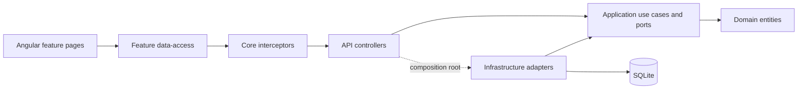

# KCOW architecture

Verified against the implementation on 12 September 2026. Earlier planning documents describe historical proposals; this document describes the running application.

## Module ownership

KCOW is a modular monolith: Angular 21 SPA, .NET 10 API, JWT bearer authentication with BCrypt, Dapper repositories, SQLite and DbUp migrations. There is no EF Core runtime or Better Auth service.

Application owns activity, attendance, audit, billing, class-group, evaluation, family, school, student and truck use cases. It references Domain and logging/DI abstractions. Infrastructure owns SQL, connections, authentication technology and import persistence. `AddApplication` registers policy; `AddInfrastructure` registers adapters. API composes both. `scripts/check_boundaries.py` rejects forbidden project references, persistence imports in Application and feature imports from frontend core.

Frontend business services live in `features/<feature>/data-access`; models remain with the feature. Auth models live under `core/auth/models`. Core owns transport, session and general application services. Shared components may compose feature services; core must not depend on features. Read service signals as signals and set component input signals through Angular inputs.

## Billing and HTTP contracts

`IBillingWriter` is the invoice/payment creation boundary. Application owns `BillingRules`; Infrastructure performs one SQLite transaction. It validates student and invoice ownership, rejects cancelled invoices, creates a final unique receipt, writes audit and updates/audits fully paid invoice status before committing. Unallocated payments remain valid; partial payments leave status unchanged. Totals use decimal values.

Invoice and payment POST endpoints accept an optional `Idempotency-Key` (1–128 printable characters), scoped to authenticated actor and operation. A canonical fingerprint includes student ID and command fields, normalizing decimal scale. The transaction stores fingerprint and returned DTO in `billing_commands`. Same key/payload replays the original result; changed payload returns 409. Replays retain identity, receipt and timestamp. Callers without a key remain supported without deduplication.

Keys are retained indefinitely; no expiry job exists. Removing receipts or restoring an older database weakens protection for commands absent from that state. Logs identify operation, actor, student and elapsed time without financial request bodies. The Angular billing service retains unresolved keys for identical manual retries during its lifetime; success retires a key. Submit guards reject concurrent clicks. Page reload does not preserve that pending map: reconcile an unknown outcome before entering a new command. External clients requiring retries across sessions must persist keys before sending.

The core error interceptor retries only GET/HEAD, at most twice, for 0, 408, 503 and 504. Writes are never automatically retried. Logging preserves the original `HttpErrorResponse` with status, headers and ProblemDetails. Feature services may map it at their boundary. The auth interceptor uses AuthService to clear token and user state on 401 and owns login navigation.

Billing's atomic audit guarantee does not extend to attendance/evaluation, whose audit calls remain separate from repository writes. Batch attendance uses a repository transaction for session row inserts/updates; existing session rows are valid update targets.

## Import plan and compatibility

`ImportPlanBuilder` parses/maps available XML/XSD pairs once. The plan has immutable mapped snapshots, diagnostics, conflict mode, run ID and SHA-256 source fingerprint. Source changes during planning reject the plan. Preview renders it; execution consumes snapshots instead of rereading files. Mapping access returns a clone. No persisted-plan file format is introduced.

`import run --help` and `--preview` never construct database services, create schema or seed data. Full import initializes schema and the required truck catalogue lazily after argument validation, without authentication seeding.

Execution orders schools, class groups, activities and students. Accepted records commit **per entity type**, not per whole run. `FailOnConflict` rejects conflicting rows but commits other accepted rows. `SkipExisting` leaves existing rows; `Update` retains identity/creation time. Reports expose imported, updated, skipped and failed counts, diagnostics, explicit per-entity commit flags, run ID and fingerprint. Each completed entity also emits a structured log. Database conflicts and school-reference validation occur at execution, so they can add diagnostics beyond a database-free preview. Ctrl+C propagates cancellation between records/before commit: the current entity rolls back; earlier entity commits remain. Reconcile before rerunning after interruption.

Legacy entity-specific tools remain compatibility entry points because their mappers have distinct identity/normalization behavior. Their stale EF Core bootstraps now use repository adapters and a shared database setup helper; all four tool projects build. Help creates no database, while count/sample and the activity preview use read-only access to existing schema. They are not silently redirected to the newer mapper. Shared orchestration belongs to the plan/executor path; legacy adapters retain repository contracts until caller/output equivalence permits retirement. Tests characterize legacy mapping, identity, relationships and billing imports. The real-tool smoke check additionally covers help/count/sample for all four tools and activity preview/import/rerun without preview writes. School creation preserves explicitly supplied legacy IDs while normal requests generate IDs; legacy billing totals use typed decimal reads.

Matching XSD files under `docs/legacy` constrain legacy domain fields. Operational table `billing_commands` is additive and does not alter those fields. Generated references and unnamed-group fallbacks emit diagnostics. Inspect warnings and rejected counts even when mapping succeeds.

## Read models and operations

`IClassGroupQueries` filters and joins a list in one database operation, retaining optional school/truck projections and ordering. `IFamilyRelationships` batches related students; a family list uses two operations. A JSON-array parameter avoids SQLite's variable-count limit. Real SQLite tests exercise 10, 100 and 1,000 rows. These are query-growth checks, not production latency benchmarks.

`/health` and `/api/health` indicate process liveness. `/health/ready` returns 200 only when a read-only connection can read the migration journal, all bundled scripts are applied and `billing_commands` exists; otherwise 503. It uses a two-second SQLite timeout/cancellation deadline and never creates schema. Development/E2E initialize before serving; production uses explicit `database migrate`. See [operations](operations.md).

## Verification

CI runs boundary checks, .NET unit/integration tests, real CLI/production-probe checks, Angular type checking/Jest and production bundling. Billing tests inject failures at receipt, audit, invoice and command-receipt writes, exercise concurrent replay and successful HTTP commands. Import tests cover immutable plans, mixed conflicts and cancellation. Database-backed tests replace mock-only billing write tests. Playwright and production load tests remain separate; green local suites do not imply deployment.
